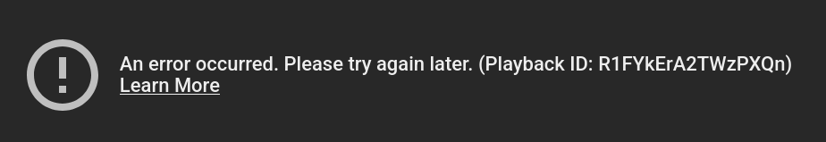
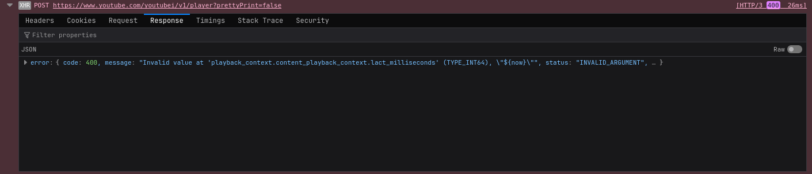
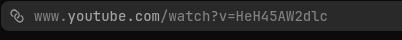
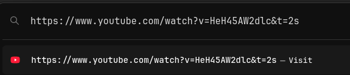


## Intro
While watching YouTube web, I've started getting an annoying error about half of the time I click on a video. 

 

The error reads: **"An error occurred. Please try again later."** 

So, the first thing I tried was simply reloading the page, no luck. 

Occasionally I've had success with just reopening the page in another browser window, 
but this is unreliable and clunky. 

I've had experience checking for web errors before, and so I opened my browser's inspect element window. 

Not finding anything by looking at the network requests, I instead checked the console. 

This error in particular stood out: 

 

###    Invalid value at 'playback_context.content_playback_context.lact_milliseconds' 

Very interesting. YouTube is requesting the video player, but it responds with an error due to
an invalid argument passed to it. 

Funnily enough, the first thing I tried actually fixed this issue...

## The Fix

Go to your browser's URL bar, and add to the end:

 

### &t=2s
 

And that's it! Press enter, the page will reload, and you can finally watch your video.

## Explanation

Whilst I am not entirely sure what causing this, I can make a pretty good guess.

YouTube web has a feature where you can share videos at a certain time, just by sending a link.

Here, let's take this URL:

    youtube.com/watch?v=HeH45AW2dtLc&t=2s

 - The "&t" is a URL parameter that the website can detect .

 - By setting this parameter to "2s", the YouTube player will start the video 2 seconds in.

 - This patches whatever was going wrong before with the console error.

Why two seconds? Why not just one?

I've found that sometimes a 1 second starting time get ignored by YouTube, so setting it to 2 seconds works more reliably.
