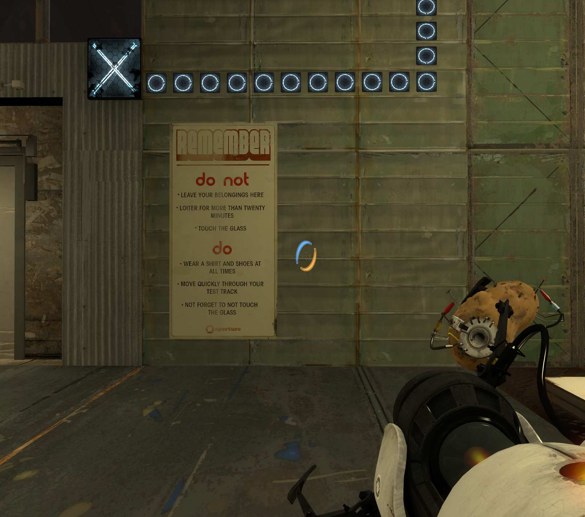
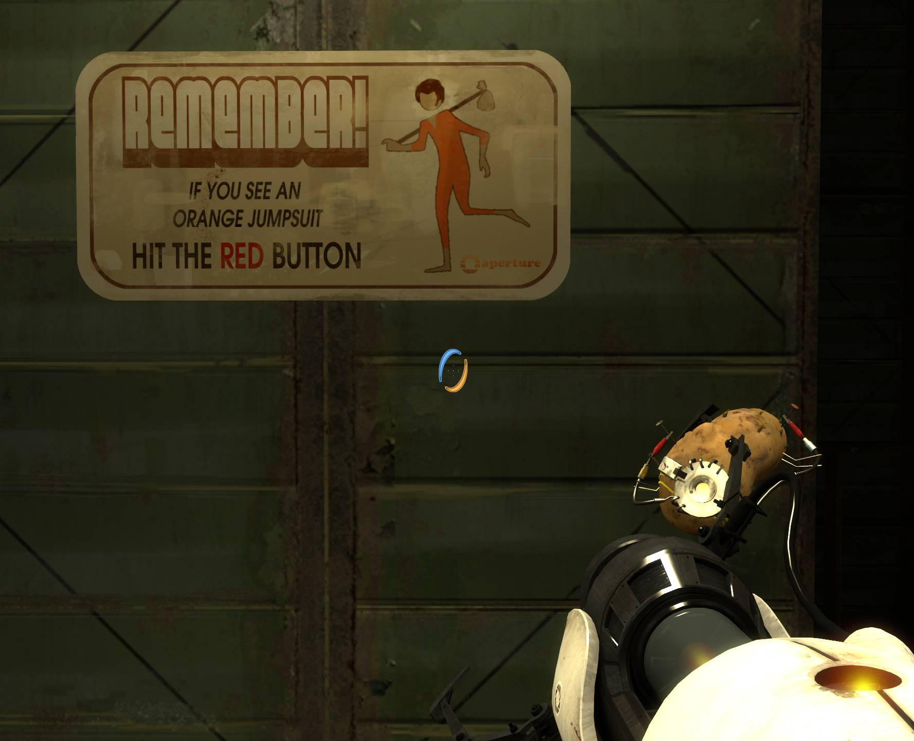
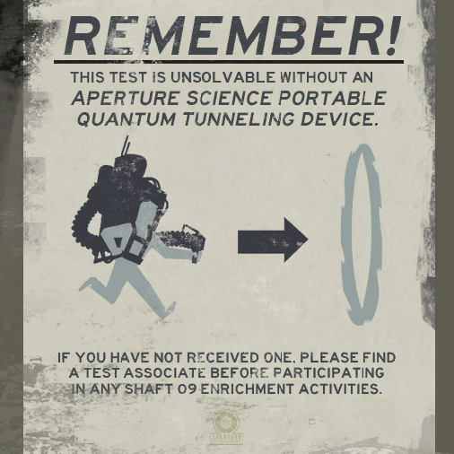
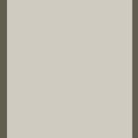
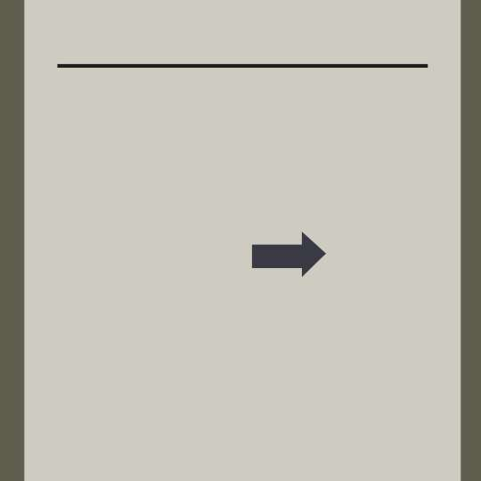
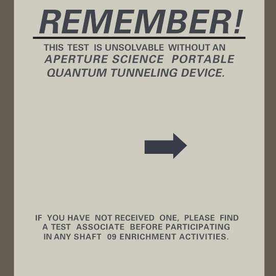
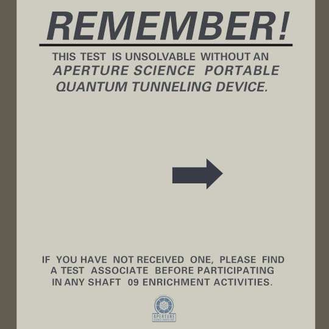
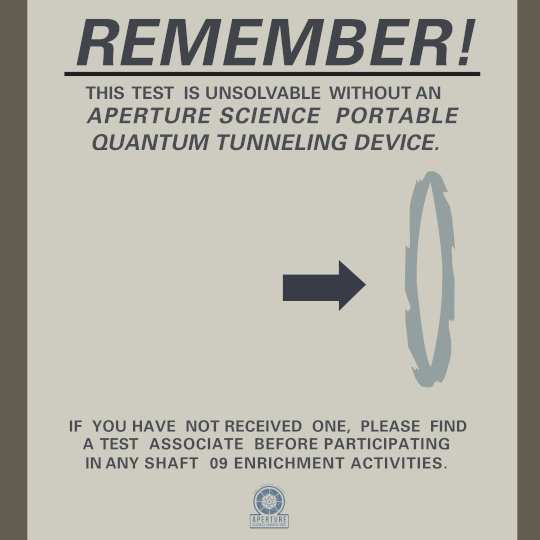
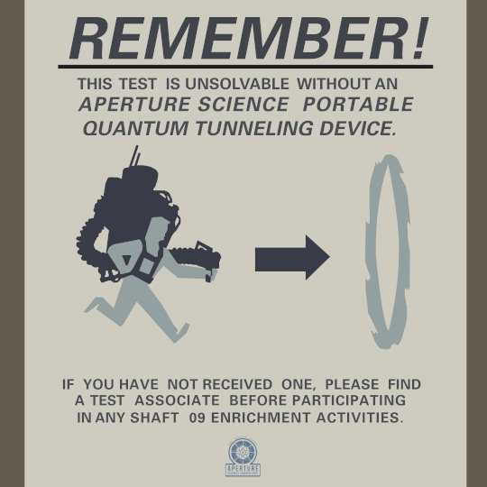
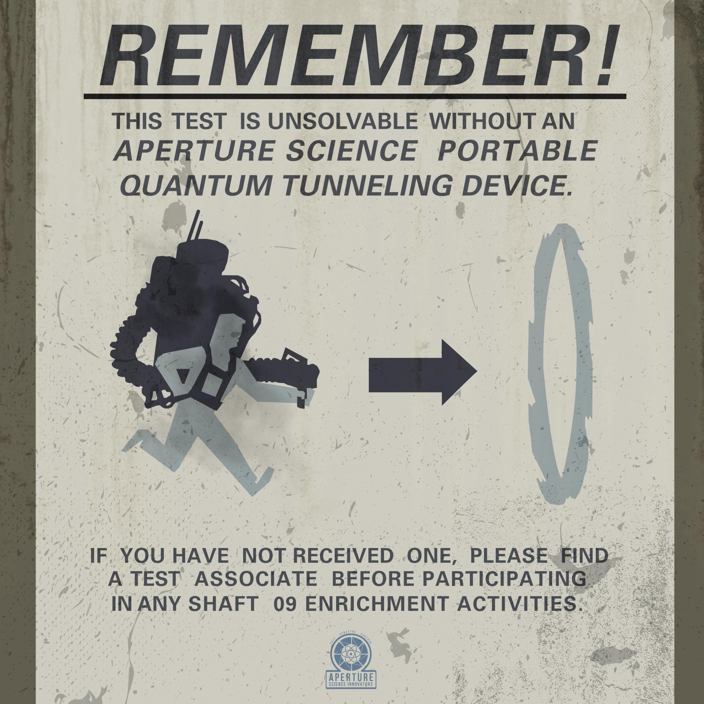

Portal 2 is one of my favourite games. From the levels to the music, the atmosphere is on point for me. 

The comedy that is almost hidden in the environment shows how much care was put into every detail. 

One of these details is the posters you find in the "Old Aperture" section of the game. 

 

 

I needed some interesting things I could put on my walls, and I remembered these posters. 

So I opened [VPKEdit](https://github.com/craftablescience/VPKEdit), to try and get the textures directly from the game;

 

But they were all so low resolution! I should have seen it coming (but sometimes I forget this game is from 2011 :P) 

And so, I set out to recreate it, at a much higher resolution, in [GIMP](https://gimp.org)! 

The background was made using a fill tool and colour picker from the original. 

 

Next was more simple elements including the underline of "*Remember!*", and the arrow pointing to the portal. 

 

Then, using trial and error, plus a lot of font guessing, I recreated the text. 

 

A detail I forgot was the "Aperture Science Innovators" logo, which I changed to blue for added contrast. 

 

Up next was the portal, which I copied the colour from the original and traced it using the path tool. 

 

Then, one of the final things, the person and their portal device. This was made using the same technique, doing both colours seperately! 

 

Last (and maybe least) is the grime and dirt on top of the image, this was just copying dirt textures from the internet and overlaying them! 

Here is the final, but not full resolution (because I downscaled it so it wouldn't use too much bandwith) result! 

 

<a href="/pages/portal/downloads/gimpfile.xcf.zip" download="Portal2-Poster-GIMPFILE-Juyoh">Download GIMP File (Zipped 16.8MB, Extracted 58.7MB)</a> 

<a href="/pages/portal/downloads/sign-4K-full.png" download="Portal2-Poster-4K-PNG-Juyoh">Download 4K PNG File (4.8MB)</a> 
